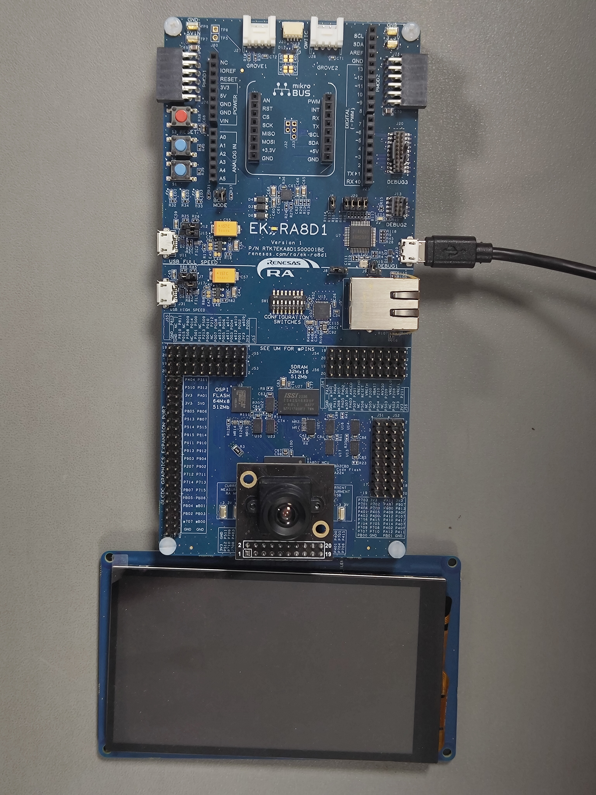

# EK-RA8D1 AI Library

A collection of AI applications for Renesas [EK-RA8D1 Evaluation Kit](https://www.renesas.com/us/en/products/microcontrollers-microprocessors/ra-cortex-m-mcus/ek-ra8d1-evaluation-kit-ra8d1-mcu-group).


## Sample applications

1. [Head Count Application](01_head_count_app/)
2. [Helmet & Vest Detection Application](02_helmet_vest_detection_app/)
3. [Age & Gender Classification Application](03_age_gender_classification_app/)
4. [Human Keypoints Detection](04_human_keypoints_detection_app/) (Experimental)

## Hardware Requirements

1. EK-RA8D1 Kit
    - EK-RA8D1 v1 board
    - Micro USB cable (type-A male to micro-B male)
    - OV3640 camera module
    - APP_LCD_EK-MIPI_1 v1 LCD board

### SW1 Configuration


Configure SW1 according to the below table.

|  **Switch**  | **State** |
|:------------:|:---------:|
|  SW1-1 PMOD1 |    OFF    |
|  SW1-2 TRACE |    OFF    |
| SW1-3 CAMERA |     ON    |
|  SW1-4 ETHA  |    OFF    |
|  SW1-5 ETHB  |    OFF    |
|  SW1-6 GLCD  |     ON    |
|  SW1-7 SDRAM |     ON    |
|   SW1-8 I3C  |    OFF    |

Assemble OV3640 camera module and APP_LCD_EK-MIPI_1 v1 LCD board on the EK-RA8D1 board as per the User's Manual. Configure Debug On-Board mode as in the below picture.



## Developing Environment

1. [e2 studio with FSP v5.0.0](https://github.com/renesas/fsp/releases/tag/v5.0.0)

Download links for:
- [Windows](https://github.com/renesas/fsp/releases/download/v5.0.0/setup_fsp_v5_0_0_e2s_v2023-10.exe)
- [Linux](https://github.com/renesas/fsp/releases/download/v5.0.0/setup_fsp_v5_0_0_e2s_v2023-10.AppImage)

## Steps to run demo application

1. Clone the repository
```
git clone https://github.com/Ignitarium-Renesas/EK-RA8D1_AiLibrary.git
```
2. Import any project in [Sample Applications](README.md#sample-applications) in e2-studio
3. Open `configuration.xml` and generate project content 
4. Build 'Debug' for the project and wait till the build finishes
5. Go to `Debug Configurations` and Select 'Debug/\<application\>.elf' and run `Debug`

For more refer the video below:

https://github.com/Ignitarium-Renesas/EK_RA8D1_AI_Library/assets/160099706/4626a7e4-0c49-41f2-a663-edd5ad2d391b

### Sample Output

1. [Head Count Application](01_head_count_app/)


