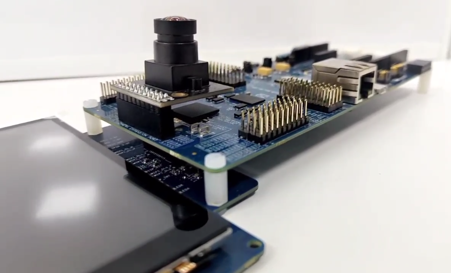
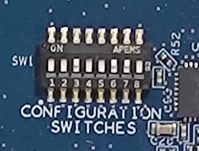
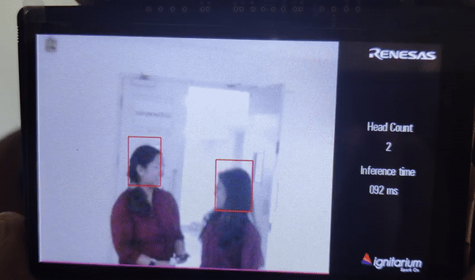
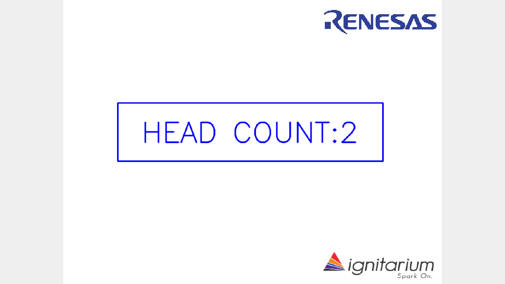

# EK-RA8D1 AI Library

A collection of AI applications for Renesas [EK-RA8D1 Evaluation Kit](https://www.renesas.com/us/en/products/microcontrollers-microprocessors/ra-cortex-m-mcus/ek-ra8d1-evaluation-kit-ra8d1-mcu-group).



## Hardware Requirements

1. EK-RA8D1 Kit
    - EK-RA8D1 v1 board
    - Micro USB cable (type-A male to micro-B male)
    - OV3640 camera module
    - APP_LCD_EK-MIPI_1 v1 LCD board

### SW1 Configuration



Configure SW1 according to the below table.

|  **Switch**  | **State** |
|:------------:|:---------:|
|  SW1-1 PMOD1 |    OFF    |
|  SW1-2 TRACE |    OFF    |
| SW1-3 CAMERA |     ON    |
|  SW1-4 ETHA  |    OFF    |
|  SW1-5 ETHB  |    OFF    |
|  SW1-6 GLCD  |     ON    |
|  SW1-7 SDRAM |     ON    |
|   SW1-8 I3C  |    OFF    |

Assemble OV3640 camera module and APP_LCD_EK-MIPI_1 v1 LCD board on the EK-RA8D1 board as per the User's Manual. Configure Debug On-Board mode as in the below picture.


## Developing Environment

1. [e2 studio with FSP v5.0.0](https://github.com/renesas/fsp/releases/tag/v5.0.0)

Download links for:
- [Windows](https://github.com/renesas/fsp/releases/download/v5.0.0/setup_fsp_v5_0_0_e2s_v2023-10.exe)
- [Linux](https://github.com/renesas/fsp/releases/download/v5.0.0/setup_fsp_v5_0_0_e2s_v2023-10.AppImage)

## Steps to run demo application

1. Clone the repository
```
git clone https://github.com/Ignitarium-Renesas/EK-RA8D1_AiLibrary.git
```
2. Import any project in [Sample Applications](README.md#sample-applications) in e2-studio
3. Open `configuration.xml` and generate project content 
4. Build 'Debug' for the project and wait till the build finishes
5. Go to `Debug Configurations` and Select 'Debug/\<application\>.elf' and run `Debug`

For more refer the video below

https://github.com/Ignitarium-Renesas/EK-RA-Renesas-AI/assets/162413112/e2a50c41-8e43-4a0a-9f83-5ba3bd257c18


### Sample Output

1. [Head Count Application](01_head_count_app/)



### To get output displayed in a laptop

1. Connect the USB to the board on Full Speed USB and other end to the laptop
2. Find the port added now, by running the below code on terminal on the laptop:
```bash
ls /dev/ttyACM*
```
3. Add the port name to the python script. This will bind the port with the python script.
4. To setup the environment for the script to run, execute the following:

```bash
python3 -m venv env3
source env3/bin/activate
pip3 install pyserial
pip3 install opencv-python
```
5. Run the program on the board and then run the python script on the laptop for printing the headcount as text only.
```
python3 display_count_img.py
```

This will open a new window showing the headcount as below.




6. To view both the headcount as text and view the video simultaneously run the python script on the laptop with -img option

```
python3 display_count_img.py -img
```
This will open a window showing the headcount and the video as below


7. To train the model using the images from the camera of the board run the same python script and press 's' to save images when the image is ready.  

```
python3 display_count_img.py
```
Please take note of the following:

- The head must be positioned above the green line displayed on the screen for successful detection.
- The position of the green line can be adjusted by modifying the negRegion parameter in the PostProcessParams.
- Additionally, you must modify the code responsible for drawing lines in the ai_object_det_screen_demo.c file to reflect the changes made to the negRegion parameter.

By adjusting the negRegion parameter and updating the line drawing code accordingly, you can change the position of the green line and ensure proper head detection.
